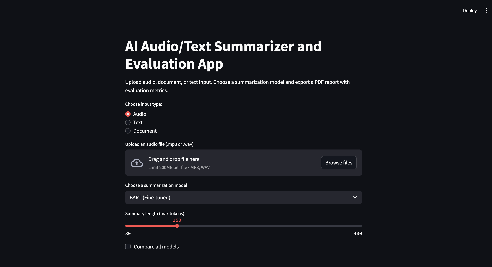
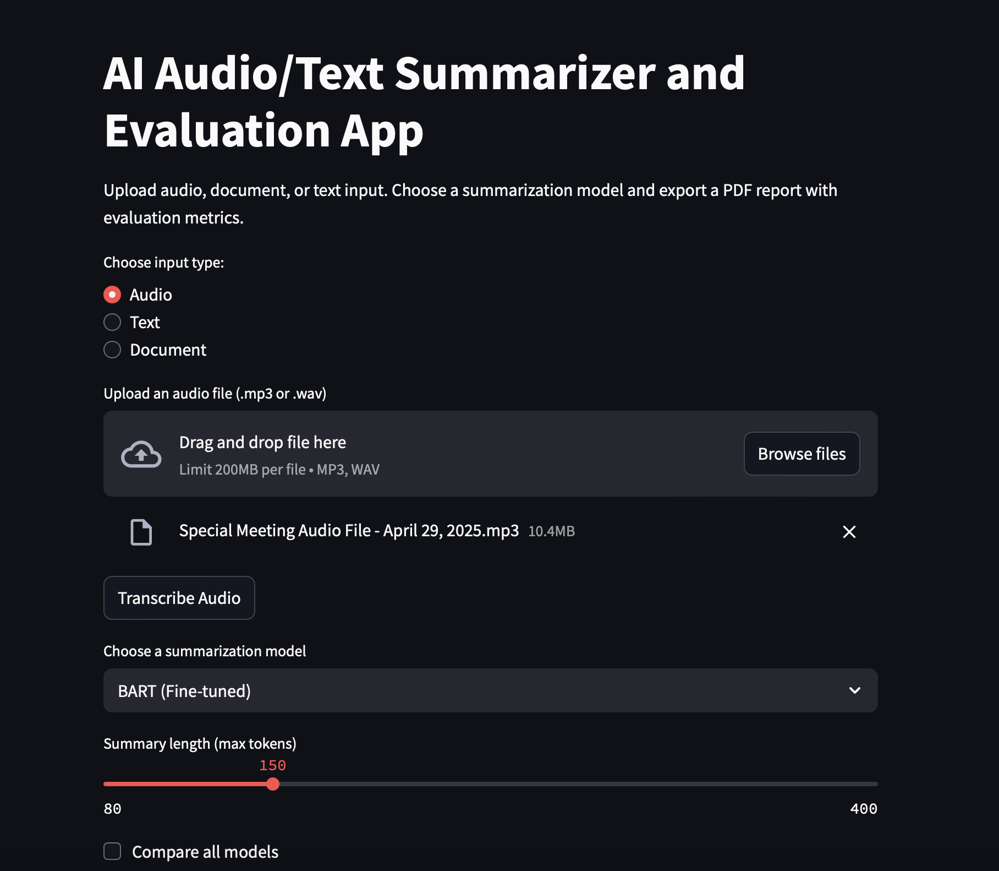
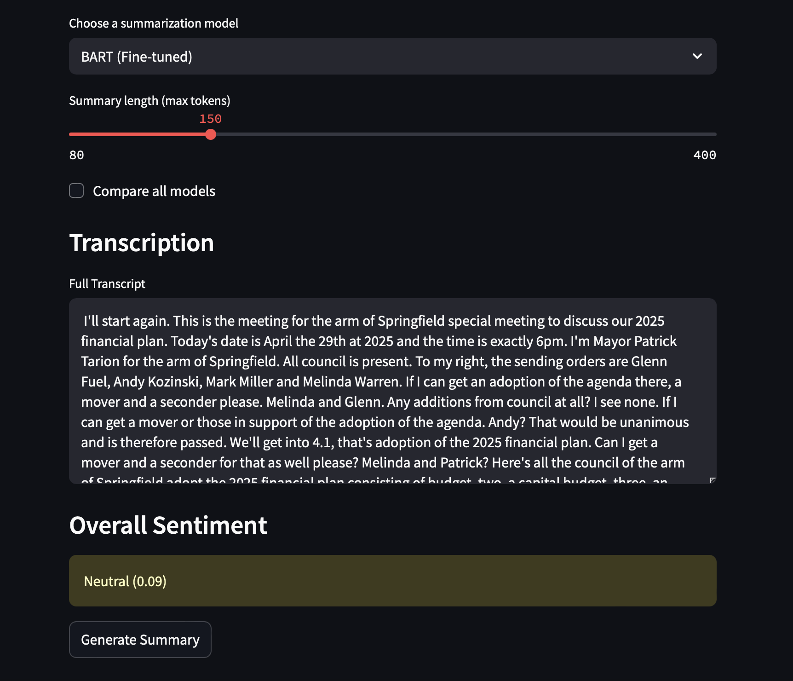
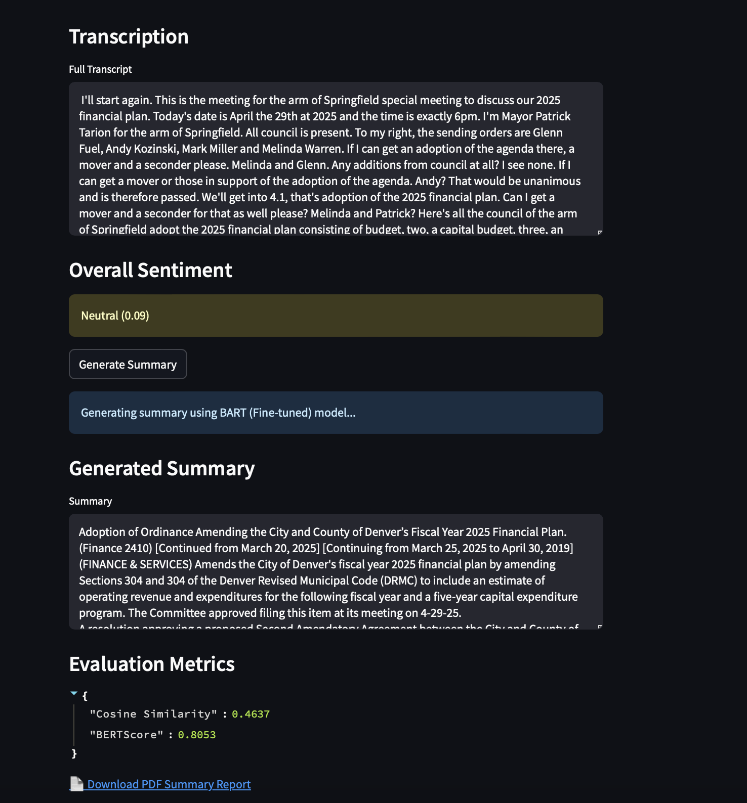

# Multimodal Summarizer AI

Audio, Text, and Document Summarization with Transformer Models + Evaluation UI


# Overview

This project enables users to summarize audio files, raw text, and .docx documents using state-of-the-art transformer models (BART, PEGASUS, T5). The Streamlit interface supports summary generation, model comparison, sentiment analysis, and evaluation metric display. A detailed PDF report is also downloadable.


# Key Features

✅ Supports Audio, Text, and Document inputs

✅ Uses Whisper for audio transcription

✅ Offers BART, PEGASUS, and T5 summarizers

✅ Generates summary reports as downloadable PDFs

✅ Computes ROUGE, Cosine Similarity, and BERTScore

✅ Includes sentiment analysis of input

✅ Supports side-by-side model comparison and metric visualization


# Models Used

| Model   | Task Type    | Source                    |
| ------- | ------------ | ------------------------- |
| BART    | Abstractive  | `facebook/bart-large-cnn` |
| PEGASUS | Abstractive  | `google/pegasus-xsum`     |
| T5      | Abstractive  | `t5-small`                |
| Whisper | Audio → Text | `openai/whisper`          |


# App Interface

### Home – Upload Options


### Uploading an Audio File


### Transcription and Sentiment Analysis


### Model Comparison and Metric Visualization (clicking on compare all models toggle from above)


### Choosing a Summarization Model based on metrics above


### Generated Summary, Metrics, and PDF Export



# Sample Summary Report
  
View a full example of the summary and evaluation for an uploaded audio file using the BART model:  
👉 [Download Summary Report (PDF)](reports/summary_report-1.pdf)


# How It Works

1) Input: User uploads audio (.wav, .mp3), text, or document (.docx)

2) Processing:

2.1) Audio is transcribed using Whisper

2.2) Text is split into chunks (if long)

3) Summarization: Selected model (BART/PEGASUS/T5) generates summaries

4) Evaluation: Metrics are computed:

4.1) ROUGE-1 and ROUGE-L

4.2) Cosine Similarity (TF-IDF)

4.3) BERTScore

5) Sentiment Analysis: Basic polarity detection using TextBlob

6) Export: Generates and downloads a PDF summary report


## Evaluation & Benchmarking

Metrics auto-generated in:

```bash
  results/summary_outputs.csv
```
```bash
  results/model_metrics.csv
```
For graphing:

```bash
  python3 -m evaluation.visualizations
```


## Project Structure


```bash
  multimodal-summarizer-ai/
├── app/
│   └── summary_app.py
├── core/
│   └── nlp_tasks.py
├── data/                #data/ not included in repo for efficient cloning
│   └── chunks.json
├── evaluation/
│   ├── metrics.py
│   ├── run_metrics.py
│   └── visualizations.py
├── models/
│   └── summarizers.py
├── results/             #results/ not included in repo(will be auto-generated depending on data/ used)
│   ├── summary_outputs.csv
│   └── model_metrics.csv
├── utils/
│   ├── preprocessing.py
│   └── audio_handler.py
├── reports/
│   └── sample_summary_report.pdf
├── images/
│   └──.png (screenshots)
├── requirements.txt
├── README.md
└── .gitignore

```


## Setup & Installation

✅ Clone Repo and Create Virtual Environment

```bash
git clone https://github.com/your-username/ multimodal-summarizer-ai.git
cd multimodal-summarizer-ai
python3 -m venv .venv
source .venv/bin/activate

```
✅ Install Requirements

```bash
  pip install -r requirements.txt
```

✅ Run the App

```bash
  streamlit run app/summary_app.py

```

# Deployment

This project is live here:

👉 Launch the App on Streamlit Cloud

# Future Work (Planned for Project + Research Phase)

1) Fine-tuning BART/PEGASUS on domain-specific meeting datasets

2) Training custom summarizers for specialized domains

3) Adding Named Entity Recognition, keyword extraction, and more advanced analytics

# Acknowledgements

1) https://huggingface.co/docs/transformers/index

2) https://github.com/openai/whisper

3) https://github.com/Tiiiger/bert_score

4) https://github.com/google-research/google-research/tree/master/rouge

5) https://streamlit.io/


# License

This project is licensed under the MIT License.


